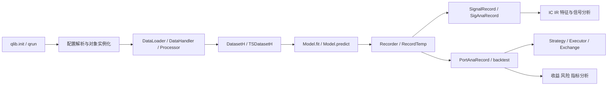

# Qlib模块详解与自定义集成指南

> 基于 Qlib 主分支源码（本地仓库状态，分析日期：2026-03-07）

## 1. 引言

### 1.1 Qlib 是什么

Qlib 是一个面向 AI 量化研究的模块化平台，核心目标不是只提供若干内置模型，而是把量化研发链路拆成可以组合的组件：数据表达式、数据处理、数据集封装、模型训练、实验记录、回测执行、结果分析、在线更新。

从源码上看，Qlib 的设计重点不是“单个超大框架类”，而是“配置驱动 + 松耦合对象组合”。几乎所有关键对象都通过统一的实例化入口按配置创建，再在训练、记录、回测阶段串联起来。

这意味着它非常适合接入个人量化项目中的自定义模块，尤其是以下五类需求：

1. 特征工程
2. 深度特征变换
3. 智能标签系统
4. 混合智能交易系统
5. 特征评估

### 1.2 本文档面向谁

本文档面向已经具备 Python、机器学习/深度学习基础，并希望把自己的量化研究模块接入 Qlib 的开发者。默认读者已经能理解 K 线、监督学习标签、训练/验证/测试分段、回测信号、IC/IR 等概念。

### 1.3 对商品期货项目的特别说明

Qlib 的抽象层并不局限于股票，但大量 contrib 示例默认以 A 股日频横截面选股为主，例如：

- 默认 benchmark 为沪深指数
- 默认交易单位、涨跌停阈值来自股票市场区域配置
- 常用策略如 TopkDropoutStrategy 假设横截面打分选股

如果你的研究对象是商品期货 K 线数据，应重点关注以下层面的适配：

1. 数据提供层：将 futures bar 数据整理为 Qlib 可访问的表达式数据或 DataFrame。
2. handler/dataset 层：将期货特征、标签组织成 feature/label 分组。
3. 策略/回测层：不要机械复用股票 Top-K 选股逻辑，而应实现适合期货多空、换月、仓位控制的 strategy/executor/exchange 配置。
4. 分析层：保留 IC/IR、特征稳定性等研究分析方法，但回测收益解释要按期货逻辑重写。

### 1.4 一个必须先纠正的认知

Qlib 主干并没有一个统一的 @model_registry 或 @dataset_registry 式注册器。它的主流扩展方式是：

- 在 Python 模块中定义类
- 在 YAML 或 Python 配置中通过 class + module_path，或全限定类名传给实例化入口
- 由 qlib.utils.mod.init_instance_by_config 动态导入并创建对象

这也是本文所有集成示例的基础。

## 2. Qlib 总体架构

### 2.1 主工作流视图



### 2.2 源码中的关键装配链路

最重要的三段代码链路如下：

1. 配置入口
   - qlib/cli/run.py
   - qrun 先渲染 Jinja2 模板、处理 BASE_CONFIG_PATH、追加 sys.path/rel_path，再调用 qlib.init 和 task_train。

2. 全局注册与实例化
   - qlib/config.py
   - qlib/utils/mod.py
   - qlib.init 最终触发 C.register()；其中会注册表达式算子、数据 provider wrapper、实验管理器。
   - init_instance_by_config 是所有自定义类接入的统一入口。

3. 训练执行
   - qlib/model/trainer.py
   - _exe_task 会创建 model、dataset，调用 model.fit(dataset)，保存模型和数据集，并按 record 列表生成信号、回测和分析结果。

### 2.3 核心概念与对应源码

| 概念 | 作用 | 关键源码 |
| --- | --- | --- |
| Dataset / DatasetH / TSDatasetH | 定义训练/验证/测试分段以及 prepare 行为 | qlib/data/dataset/__init__.py |
| DataLoader | 从底层源加载原始 DataFrame | qlib/data/dataset/loader.py |
| DataHandler / DataHandlerLP | 维护原始数据与处理流水线 | qlib/data/dataset/handler.py |
| Processor | 对 DataFrame 做 fit/transform | qlib/data/dataset/processor.py |
| Model / ModelFT | 模型训练与预测抽象 | qlib/model/base.py |
| Trainer / task_train | 执行任务、保存 recorder | qlib/model/trainer.py |
| Signal | 统一信号接口 | qlib/backtest/signal.py |
| BaseStrategy | 交易决策接口 | qlib/strategy/base.py |
| RecordTemp | 结果生成模板 | qlib/workflow/record_temp.py |
| FeatureInt | 特征重要性接口 | qlib/model/interpret/base.py |

### 2.4 配置驱动的工作流为什么是 Qlib 扩展的核心

Qlib 的很多“扩展能力”其实不是靠继承链本身，而是靠“配置中可声明任意类”这一能力实现的。

以 qrun 为例，一个 YAML 至少有三层关键结构：

```yaml
qlib_init:
  provider_uri: "~/.qlib/qlib_data/cn_data"
  region: cn

task:
  model:
    class: SomeModel
    module_path: your_project.models
    kwargs: {...}
  dataset:
    class: DatasetH
    module_path: qlib.data.dataset
    kwargs:
      handler:
        class: SomeHandler
        module_path: your_project.data
        kwargs: {...}
      segments:
        train: [2020-01-01, 2022-12-31]
        valid: [2023-01-01, 2023-06-30]
        test: [2023-07-01, 2024-12-31]
  record:
    - class: SignalRecord
      module_path: qlib.workflow.record_temp
      kwargs:
        model: <MODEL>
        dataset: <DATASET>
```

这里有四个非常关键的机制：

1. class + module_path
   - 由 init_instance_by_config 导入类并实例化。
2. 全限定类名
   - class 也可以直接写成 your_project.models.SomeModel。
3. placeholder
   - trainer 会把 <MODEL>、<DATASET>、<PRED> 替换成真实对象或真实预测结果。
4. sys.path / rel_path
   - qrun 支持在 YAML 中把你的自定义模块目录加入 Python 搜索路径。

### 2.5 Qlib 全功能版图

如果从“整个项目全部代码提供了哪些能力”而不是“单个训练工作流如何运行”来观察，Qlib 可以分成 12 类核心功能：

1. 数据基础设施
  - 本地二进制数据、provider、缓存、PIT、client/server 模式。
2. 因子表达式与特征工程
  - 表达式 DSL、内置算子、自定义算子、DataLoader、Processor。
3. 数据集与样本构造
  - DatasetH、TSDatasetH、TSDataSampler、多数据源拼接。
4. 监督学习模型
  - 线性、GBDT、XGBoost、CatBoost、各类 PyTorch 模型。
5. 深度时序建模
  - LSTM、GRU、ALSTM、TCN、Transformer、GATs、TRA 等。
6. 集成学习与解释
  - DoubleEnsemble、rolling ensemble、FeatureInt 特征解释。
7. 风险建模与组合优化
  - 风险模型、增强指数、组合优化策略。
8. 回测与执行引擎
  - Signal、Strategy、Executor、Exchange、Account、Position。
9. 分析与报告
  - IC/IR、分组收益、风险分析、持仓分析、图表报告。
10. 工作流与实验管理
  - qrun、Recorder、Task、MLflow 实验管理。
11. 在线服务与滚动更新
  - online manager、模型滚动、线上策略更新。
12. 强化学习与高频研究
  - RL 订单执行、高频 handler、高频数据处理与示例。

从成熟度看：

1. data、dataset、model base、backtest、workflow、record、strategy 抽象是主干稳定能力。
2. 具体模型 zoo、元学习、滚动训练、在线扩展、RL、高频示例主要集中在 contrib、rl 与 examples，更偏研究或进阶能力。

## 3. 核心模块详解与扩展点

## 3.1 配置装配与注册机制

### 3.1.1 init_instance_by_config：所有自定义对象的总入口

源码位置：

- qlib/utils/mod.py

这个函数支持以下输入形式：

1. 字典配置
2. 字符串类名或全限定类名
3. Path / file:// pickle 对象
4. 已经是目标类型的实例

它的典型配置格式是：

```python
{
    "class": "MyClass",
    "module_path": "my_project.my_module",
    "kwargs": {"x": 1, "y": 2},
}
```

或者：

```python
{
    "class": "my_project.my_module.MyClass",
    "kwargs": {"x": 1, "y": 2},
}
```

推荐实践：

1. 所有自定义模块都优先采用这两种格式，不要依赖 monkey patch。
2. 仅当对象已在 Python 代码中直接构造时，才传实例。
3. 在团队项目里，优先写全限定类名，减少 module_path 省略带来的歧义。

### 3.1.2 qrun 做了哪些额外工作

源码位置：

- qlib/cli/run.py

qrun 的流程不是简单 YAML 加载，而是：

1. render_template
   - 支持用环境变量渲染 Jinja2 模板。
2. BASE_CONFIG_PATH
   - 支持配置继承。
3. sys_config
   - 支持 sys.path 和相对路径注入。
4. qlib.init
   - 注册 provider、表达式算子、实验管理器。
5. task_train
   - 启动训练和 record 生成。

因此，当你把个人项目模块接入 Qlib 时，最稳妥的方法不是改 Qlib 源码，而是：

1. 把自定义代码放到自己的 Python 包目录
2. 在 YAML 的 sys.rel_path 或 sys.path 中加入该目录
3. 在 task 里声明自定义类

### 3.1.3 custom_ops：表达式级特征扩展

源码位置：

- qlib/config.py
- qlib/data/ops.py
- qlib/utils/__init__.py 中的 parse_field

Qlib 的表达式引擎会把类似 $close、Ref($close, 1)、Mean($close, 5) 这样的字符串解析为 Expression/ExpressionOps 对象。启动时，config.register 会调用 register_all_ops(C)，其中会把 C.custom_ops 注册到 Operators 包装器里。

这条扩展路径特别适合：

- 技术指标
- 价格/成交量滚动统计
- 可写成“表达式算子”的因子

它不适合：

- 依赖复杂外部状态的特征
- 需要跨资产图结构、神经网络编码器的深度特征
- 需要先训练再变换的特征

## 3.2 数据处理模块：DataLoader、DataHandler、Processor、TSDatasetH

### 3.2.1 DataLoader：原始数据入口

源码位置：

- qlib/data/dataset/loader.py

核心抽象：

```python
class DataLoader(abc.ABC):
    def load(self, instruments, start_time=None, end_time=None) -> pd.DataFrame:
        ...
```

重要内置实现：

1. QlibDataLoader
   - 用表达式引擎 D.features 拉取 feature/label。
2. StaticDataLoader
   - 从 DataFrame、pickle、parquet 加载。
3. NestedDataLoader
   - 合并多个 DataLoader。
4. DataLoaderDH
   - 从一个或多个 DataHandler 中取数。

当你的个人项目已经有成熟的数据管线时，最快的接入方式通常不是重写 provider，而是：

1. 先把特征和标签整理成标准 MultiIndex DataFrame
2. 用 StaticDataLoader 或自定义 DataLoader 接入
3. 再复用 DataHandlerLP/Processor/TSDatasetH

### 3.2.2 DataHandler：承载 DataFrame 的中间层

源码位置：

- qlib/data/dataset/handler.py

DataHandler 的职责：

1. 持有底层加载好的 DataFrame
2. 提供 fetch(selector, level, col_set, data_key) 接口
3. 隐藏底层数据组织方式

它适合：

- 数据已经基本成型，只需要统一 fetch 接口

### 3.2.3 DataHandlerLP：Qlib 最实用的扩展点

源码位置：

- qlib/data/dataset/handler.py

DataHandlerLP 在 DataHandler 基础上加入三份数据语义：

- raw: 原始数据
- infer: 推理用数据
- learn: 训练用数据

它维护三类处理器：

1. shared_processors
2. infer_processors
3. learn_processors

并支持两种处理模式：

1. independent
   - infer 与 learn 各自独立从 shared 输出继续处理。
2. append
   - learn 在 infer 结果上继续追加 learn_processors。

这正是“训练可看标签、推理不可看标签”这类量化任务的关键实现点。

例如：

- 标准化可同时用于训练和推理，放在 infer/shared。
- 基于标签删样本，只能放在 learn_processors。

### 3.2.4 Processor：最适合特征清洗与标签后处理

源码位置：

- qlib/data/dataset/processor.py

Processor 协议很简单：

```python
class Processor(Serializable):
    def fit(self, df=None):
        ...
    def __call__(self, df):
        ...
    def is_for_infer(self) -> bool:
        return True
    def readonly(self) -> bool:
        return False
```

这几个方法的含义非常重要：

1. fit
   - 学习训练期统计量，例如均值、方差、分位数。
2. __call__
   - 真正做 transform。
3. is_for_infer
   - 若返回 False，则不能放入 infer_processors。
4. readonly
   - 告诉 handler 是否需要复制 DataFrame，影响性能和内存。

### 3.2.5 Alpha158/Alpha360：官方最值得模仿的 handler 模板

源码位置：

- qlib/contrib/data/handler.py

这些类的设计非常值得学习：

1. 通过 get_feature_config / get_label_config 把表达式层配置抽象成方法
2. 通过 check_transform_proc 自动把 fit_start_time / fit_end_time 注入处理器
3. 用 QlibDataLoader 组装 feature/label 两个 group

如果你要接入自己的因子工程和标签系统，最佳实践通常是“仿照 Alpha158 自定义一个 handler 子类”，而不是从零散落地写在 notebook 中。

### 3.2.6 TSDatasetH：把截面表转成时序样本

源码位置：

- qlib/data/dataset/__init__.py

TSDatasetH 做了两件事：

1. 先按时间扩展 slice，保证每个样本前面有足够历史步长
2. 再构造 TSDataSampler，把二维表转成 step_len 长度的时序样本

这条链路对于以下场景非常关键：

- LSTM
- GRU
- TCN
- Transformer
- 自定义 attention encoder

如果你的深度特征变换本质是“基于过去 N 根 K 线编码得到隐变量”，通常应该选 TSDatasetH，而不是 DatasetH。

## 3.3 模型模块：Model、Trainer、PyTorch 适配器

### 3.3.1 Model / ModelFT：最小模型协议

源码位置：

- qlib/model/base.py

Qlib 对模型要求很克制，核心只有两个方法：

1. fit(dataset, reweighter)
2. predict(dataset, segment="test")

ModelFT 额外增加 finetune(dataset)。

这意味着把自定义模型接入 Qlib 的门槛很低。只要你的类能：

1. 从 dataset.prepare 取到 feature/label
2. 完成训练
3. 输出带 MultiIndex 的 Series 或 DataFrame

它就能进入 Qlib 的训练、记录、回测主链路。

### 3.3.2 Trainer：task 的实际执行器

源码位置：

- qlib/model/trainer.py

_exe_task 的核心流程是：

1. 初始化 model
2. 初始化 dataset
3. 调用 model.fit(dataset)
4. 保存模型对象 params.pkl
5. 保存 dataset
6. 创建 record 并生成 pred、IC、回测分析

对扩展者最重要的结论是：

1. 只要 model.fit 和 model.predict 符合约定，就能自动被 workflow 驱动。
2. record 阶段与模型本身解耦，你可以自定义分析记录器，而不必把分析逻辑塞进模型类。

### 3.3.3 DNNModelPytorch 与 GeneralPTNN：深度模型接入的两个现成模板

源码位置：

- qlib/contrib/model/pytorch_nn.py
- qlib/contrib/model/pytorch_general_nn.py

这两个类都展示了一个重要思想：

- Qlib 模型包装器负责 dataset.prepare、训练循环、early stop、保存/加载
- 具体神经网络结构可以继续通过 pt_model_uri + pt_model_kwargs 注入

这非常适合你的“深度特征变换”需求，因为你不一定要重写整个 Qlib 模型类，可以先重写 nn.Module，再把它注入现有包装器。

推荐策略：

1. 仅替换网络结构
   - 优先用 GeneralPTNN 或 DNNModelPytorch + pt_model_uri。
2. 需要完全自定义训练逻辑
   - 自己实现一个 Model 子类。

### 3.3.4 FeatureInt：特征重要性接口

源码位置：

- qlib/model/interpret/base.py

如果你的模型能输出特征重要性，建议实现 FeatureInt：

```python
class FeatureInt:
    def get_feature_importance(self) -> pd.Series:
        ...
```

这能让特征评估逻辑和模型接口更统一。LightGBM、XGBoost、CatBoost、DoubleEnsemble 都已经这样做。

## 3.4 标签系统：标签本质上也是数据分组

### 3.4.1 Qlib 里的 label 并不是单独子系统

Qlib 主干没有一个专门叫 LabelEngine 的子系统。标签通常通过以下两种方式接入：

1. 在 DataLoader 配置里把一组表达式命名为 label
2. 在 learn_processors 中对 label group 做进一步处理

这在 Alpha158/Alpha360 里很清楚：

- feature 和 label 都是 QlibDataLoader 的 group
- get_label_config 决定标签表达式

### 3.4.2 什么时候用表达式标签，什么时候用 Processor/Handler 标签

推荐判断标准：

1. 能用表达式写清楚
   - 优先写在 label 配置里。
   - 例如未来 N 日收益率、价差、滚动波动调整收益。
2. 依赖复杂路径或外部风险模型
   - 放到自定义 DataLoader / DataHandler / Processor。
3. 训练样本过滤依赖标签
   - 放到 learn_processors，且 is_for_infer 返回 False。

### 3.4.3 一个容易犯错的点：泄漏

Qlib 不会自动帮你阻止所有未来信息泄漏。你必须自己保证：

1. fit_start_time / fit_end_time 只覆盖训练期
2. label 只在 learn 数据中使用
3. infer_processors 不依赖未来信息或标签信息
4. 验证集使用的 valid_key 是否合理

## 3.5 回测与交易：Signal、Strategy、PortAnaRecord

### 3.5.1 Signal：模型输出到策略输入的桥

源码位置：

- qlib/backtest/signal.py

Signal 是一个非常重要但经常被忽略的抽象。它统一了几种不同来源的交易信号：

1. 直接给 pandas.Series/DataFrame
2. 给 (model, dataset)
3. 给 dict/str 配置
4. 给自定义 Signal 对象

BaseSignalStrategy 会调用 create_signal_from，把这些输入统一转成 Signal 实例。

这意味着“混合智能交易系统”最自然的实现点之一就是自定义 Signal，而不是一上来改回测引擎。

### 3.5.2 BaseStrategy：交易决策最小接口

源码位置：

- qlib/strategy/base.py

核心只要求实现：

```python
def generate_trade_decision(self, execute_result=None):
    ...
```

任何能输出 BaseTradeDecision 的对象都可以作为 strategy 接入 backtest。

### 3.5.3 官方信号策略模板

源码位置：

- qlib/contrib/strategy/signal_strategy.py

这里最值得借鉴的两个类：

1. TopkDropoutStrategy
   - 典型横截面打分换仓策略。
2. WeightStrategyBase
   - 先生成目标权重，再通过 order generator 生成订单。

对于商品期货项目，通常不建议直接拿 TopkDropoutStrategy 作为最终生产策略，但可以学习其信号拉取和调仓时序逻辑，再实现符合期货多空/持仓/换月约束的自定义策略。

### 3.5.4 PortAnaRecord：把预测自动接到回测

源码位置：

- qlib/workflow/record_temp.py

PortAnaRecord 的价值在于，它把以下动作自动化了：

1. 读取 pred.pkl
2. 用 <PRED> 占位符注入 strategy config
3. 运行 normal_backtest
4. 输出 report_normal、positions_normal、风险分析、指标分析

这意味着你只要让 pred.pkl 的格式正确，就可以把任意模型、任意 Signal/Strategy 接进统一工作流。

## 3.6 分析与评估：SigAnaRecord、FeatureInt、analysis_model

### 3.6.1 信号分析

源码位置：

- qlib/workflow/record_temp.py
- qlib/contrib/eva/alpha.py

SigAnaRecord 会读取 pred.pkl 和 label.pkl，计算：

1. IC
2. ICIR
3. Rank IC
4. Rank ICIR
5. 可选 long-short / long-average 统计

这些指标就是你做特征评估、标签有效性评估、模型稳定性评估的第一层标准件。

### 3.6.2 模型表现可视化

源码位置：

- qlib/contrib/report/analysis_model/analysis_model_performance.py

这里实现了：

1. group return
2. pred_ic
3. pred_autocorr
4. pred_turnover

如果你的目标是“对生成特征做 IC/IR、稳定性分析”，最方便的方法不是自己从零画图，而是复用这些函数，或者仿照它们写自己的 RecordTemp。

### 3.6.3 特征重要性

源码位置：

- qlib/model/interpret/base.py
- qlib/contrib/model/double_ensemble.py

如果模型支持 FeatureInt，评估模块可以直接调用 get_feature_importance。对深度模型，如果没有天然 importance，可以输出：

1. attention 权重汇总
2. permutation importance
3. SHAP 或 Integrated Gradients 聚合结果

并以 FeatureInt 的返回格式统一出来。

## 3.7 主包全部功能模块详解

这一节不再只围绕“自定义集成入口”，而是对 qlib 主包中的每一个一级功能模块做系统说明。

### 3.7.1 qlib 顶层模块索引

| 模块 | 主要职责 | 关键文件 | 功能属性 |
| --- | --- | --- | --- |
| qlib/__init__.py | 初始化入口、版本管理、qlib.init、auto_init | qlib/__init__.py | 主干稳定能力 |
| qlib/config.py | 全局配置、region/default_conf、provider/cache/exp_manager 注册 | qlib/config.py | 主干稳定能力 |
| qlib/constant.py | 市场区域常量、交易规则常量 | qlib/constant.py | 基础设施 |
| qlib/log.py | 日志器、统一日志格式、TimeInspector | qlib/log.py | 基础设施 |
| qlib/typehint.py | 配置与实例描述类型别名 | qlib/typehint.py | 基础设施 |
| qlib/data | 数据基础设施与表达式引擎 | qlib/data/* | 主干稳定能力 |
| qlib/model | 模型抽象、训练器、集成、解释、风险模型 | qlib/model/* | 主干稳定能力 |
| qlib/backtest | 回测与执行引擎 | qlib/backtest/* | 主干稳定能力 |
| qlib/strategy | 策略抽象接口 | qlib/strategy/base.py | 主干稳定能力 |
| qlib/workflow | 实验管理、记录器、任务流、在线工作流 | qlib/workflow/* | 主干稳定能力 |
| qlib/rl | 强化学习交易与订单执行 | qlib/rl/* | 研究/扩展能力 |
| qlib/utils | 配置解析、序列化、时间、并行、文件、模块装配 | qlib/utils/* | 工程底座 |
| qlib/cli | 命令行入口 | qlib/cli/run.py | 开发运维能力 |
| qlib/tests | 包内测试与样例校验 | qlib/tests/* | 工程保障 |

### 3.7.2 data：数据基础设施与表达式计算中枢

源码目录：

- qlib/data

data 子系统是整个框架的基础层，几乎所有训练、回测、分析能力都建立在它之上。它可以拆成六个部分：

1. 数据 provider 抽象
  - 关键文件：qlib/data/data.py
  - 职责：统一 calendar、instrument、feature、expression、dataset、pit provider 的访问接口。
  - 典型能力：D.features、D.instruments、provider wrapper 注册、client/server 模式切换。

2. 表达式系统
  - 关键文件：qlib/data/base.py、qlib/data/ops.py
  - 职责：把因子表达式字符串解析成 Expression/ExpressionOps 计算图。
  - 典型能力：Feature、Ref、Mean、Std、rolling/pair/logical operator、自定义 custom_ops。

3. 数据集加载层
  - 关键文件：qlib/data/dataset/loader.py
  - 职责：从 provider、文件、DataFrame 或多个数据源构造统一 DataFrame。
  - 典型能力：QlibDataLoader、StaticDataLoader、NestedDataLoader、DataLoaderDH。

4. 数据处理与样本构造层
  - 关键文件：qlib/data/dataset/handler.py、qlib/data/dataset/processor.py、qlib/data/dataset/__init__.py
  - 职责：维护 raw/infer/learn 数据、处理特征/标签、切分样本、构造时序窗口。
  - 典型能力：DataHandlerLP、Processor、DatasetH、TSDatasetH、TSDataSampler。

5. 缓存与存储
  - 关键文件：qlib/data/cache.py、qlib/data/storage/*
  - 职责：表达式缓存、数据集缓存、文件存储与磁盘缓存。

6. 特殊数据支持
  - 关键文件：qlib/data/pit.py、qlib/data/inst_processor.py、qlib/data/filter.py
  - 职责：PIT 数据、instrument 级别预处理与标的过滤。

理解要点：

1. 任何“数据怎么来、特征怎么算、样本怎么切”的问题，优先在 data 子系统解决。
2. 商品期货 K 线、主力连续、换月映射、品种特征等自定义数据工程，也主要落在这里。

### 3.7.3 model：模型抽象、训练器、集成与风险模型

源码目录：

- qlib/model

它主要由五部分组成：

1. 模型抽象
  - 关键文件：qlib/model/base.py
  - 职责：定义 BaseModel、Model、ModelFT 协议。

2. 训练器
  - 关键文件：qlib/model/trainer.py
  - 职责：按 task 执行训练、记录器保存、延迟训练、并行训练。

3. 集成学习
  - 关键文件：qlib/model/ens/ensemble.py、qlib/model/ens/group.py
  - 职责：滚动训练结果分组、结果聚合与 ensemble。

4. 模型解释
  - 关键文件：qlib/model/interpret/base.py
  - 职责：统一特征重要性输出接口。

5. 风险模型
  - 关键文件：qlib/model/riskmodel/base.py、structured.py、shrink.py、poet.py
  - 职责：风险建模、协方差估计、结构化风险矩阵估计。

理解要点：

1. model 主包更偏抽象和通用机制。
2. 具体模型 zoo 主要在 contrib/model，而不是主包本身。

### 3.7.4 backtest：订单、成交、账户、报告的一整套执行引擎

源码目录：

- qlib/backtest

该子系统可以拆成八个模块：

1. 调用入口
  - 关键文件：qlib/backtest/__init__.py
  - 职责：构造 strategy/executor/exchange/account 并发起 backtest/collect_data。

2. 回测主循环
  - 关键文件：qlib/backtest/backtest.py
  - 职责：按时间推进策略与执行器交互。

3. 执行器
  - 关键文件：qlib/backtest/executor.py
  - 职责：不同粒度与层级的执行控制，支持嵌套执行。

4. 交易决策与订单对象
  - 关键文件：qlib/backtest/decision.py
  - 职责：BaseTradeDecision、Order、方向、执行结果传递。

5. 交易所与撮合
  - 关键文件：qlib/backtest/exchange.py
  - 职责：可交易性判断、成交价、成本、交易单位、涨跌停逻辑。

6. 账户与持仓
  - 关键文件：qlib/backtest/account.py、qlib/backtest/position.py
  - 职责：现金、持仓、资产价值更新。

7. 信号桥接
  - 关键文件：qlib/backtest/signal.py
  - 职责：把 pandas/model/dataset/Signal 对象统一成可供策略消费的信号对象。

8. 报告与归因
  - 关键文件：qlib/backtest/report.py、qlib/backtest/profit_attribution.py
  - 职责：收益报告、指标整理、收益归因。

理解要点：

1. 交易逻辑、撮合、成本和持仓问题通常不在模型里，而在 backtest 子系统。
2. 商品期货项目通常至少需要定制 exchange 参数，很多场景还需要自定义 strategy 或 executor。

### 3.7.5 strategy：策略抽象层

源码目录：

- qlib/strategy

主包 strategy 比较薄，核心是协议定义：

1. BaseStrategy
  - 关键文件：qlib/strategy/base.py
  - 职责：定义 generate_trade_decision、基础设施注入、跨层嵌套接口。

2. RLStrategy / RLIntStrategy
  - 关键文件：qlib/strategy/base.py
  - 职责：把 RL policy、state_interpreter、action_interpreter 接入统一策略接口。

理解要点：

1. 主包 strategy 提供的是统一协议，不是丰富的现成策略库。
2. 常用的信号策略、规则策略、优化策略主要位于 contrib/strategy。

### 3.7.6 workflow：训练、记录、任务编排与在线管理

源码目录：

- qlib/workflow

这一层承担“实验系统”角色，可拆成六部分：

1. Recorder 与实验管理
  - 关键文件：qlib/workflow/recorder.py、qlib/workflow/expm.py、qlib/workflow/exp.py
  - 职责：保存对象、记录参数/指标、管理实验与运行实例。

2. Record 模板
  - 关键文件：qlib/workflow/record_temp.py
  - 职责：SignalRecord、SigAnaRecord、PortAnaRecord、多次回测分析等。

3. 任务系统
  - 关键文件：qlib/workflow/task/manage.py、gen.py、collect.py、utils.py
  - 职责：任务生成、任务管理、滚动任务与 artifact 收集。

4. 在线工作流
  - 关键文件：qlib/workflow/online/manager.py、update.py、strategy.py
  - 职责：在线更新、线上策略管理、在线模型迭代。

5. 工具层
  - 关键文件：qlib/workflow/utils.py
  - 职责：实验退出处理、workflow 辅助函数。

6. 运行入口桥接
  - 关键文件：qlib/cli/run.py 与 qlib/model/trainer.py 共同构成 qrun 执行链。

理解要点：

1. workflow 是 Qlib 从“代码库”变成“研究平台”的关键层。
2. 如果要做规范化研发、实验追踪、结果复现，workflow 非常重要。

### 3.7.7 rl：强化学习交易研究子系统

源码目录：

- qlib/rl

rl 不是主干监督学习工作流的一部分，但它提供了订单执行与交互式决策的研究框架，主要包括：

1. 环境与模拟
  - 关键文件：qlib/rl/simulator.py、qlib/rl/data/*

2. 状态/动作解释器
  - 关键文件：qlib/rl/interpreter.py

3. 奖励函数
  - 关键文件：qlib/rl/reward.py

4. 订单执行 RL
  - 关键文件：qlib/rl/order_execution/*

5. 训练相关工具
  - 关键文件：qlib/rl/trainer/*、qlib/rl/contrib/*

理解要点：

1. 这部分更偏前沿研究与订单执行场景。
2. 如果你的目标是先把因子、标签、监督模型和回测打通，可以先不依赖 rl 子系统。

### 3.7.8 utils、config、log：工程底座

这些模块虽然不是业务模块，但决定了整个框架是否可配置、可序列化、可复用：

1. qlib/utils/mod.py
  - 动态导入与 init_instance_by_config，是自定义集成的总入口。
2. qlib/utils/serial.py
  - 对象序列化、dump_all/recursive 行为。
3. qlib/utils/time.py、resam.py、paral.py
  - 时间频率、重采样、并行工具。
4. qlib/config.py
  - provider/cache/exp_manager/custom_ops 注册与全局配置管理。
5. qlib/log.py
  - 统一日志控制与耗时分析工具。

## 3.8 contrib 扩展模块详解

contrib 不是单一功能模块，而是 Qlib 的“模型 zoo + 研究功能扩展区”。它承载了大量论文复现、研究范式与垂直场景代码。

### 3.8.1 contrib 一级模块索引

| 模块 | 主要职责 | 关键文件/目录 | 能力属性 |
| --- | --- | --- | --- |
| qlib/contrib/data | 扩展数据处理、高频 handler、额外 processor 和 loader | qlib/contrib/data/* | 研究/扩展能力 |
| qlib/contrib/eva | alpha 评估函数，如 calc_ic | qlib/contrib/eva/alpha.py | 通用分析能力 |
| qlib/contrib/evaluate.py | 回测与风险分析兼容接口 | qlib/contrib/evaluate.py | 通用分析能力 |
| qlib/contrib/evaluate_portfolio.py | 投资组合分析辅助 | qlib/contrib/evaluate_portfolio.py | 组合分析能力 |
| qlib/contrib/meta | 元学习与数据选择 | qlib/contrib/meta/data_selection/* | 前沿研究能力 |
| qlib/contrib/model | 具体模型 zoo | qlib/contrib/model/* | 研究/模型实现 |
| qlib/contrib/online | 在线模型与用户/管理逻辑 | qlib/contrib/online/* | 在线扩展能力 |
| qlib/contrib/ops | 额外算子或算子相关扩展 | qlib/contrib/ops/* | 扩展能力 |
| qlib/contrib/report | 图表报告、模型分析、持仓分析 | qlib/contrib/report/* | 分析与可视化 |
| qlib/contrib/rolling | 滚动训练与动态数据选择 | qlib/contrib/rolling/* | 研究/生产桥接 |
| qlib/contrib/strategy | 信号策略、规则策略、优化策略 | qlib/contrib/strategy/* | 核心扩展能力 |
| qlib/contrib/torch.py | torch 兼容辅助 | qlib/contrib/torch.py | 深度学习辅助 |
| qlib/contrib/tuner | 超参数调优 | qlib/contrib/tuner/* | 研究/工程能力 |
| qlib/contrib/workflow | 额外 record 模板 | qlib/contrib/workflow/* | 工作流扩展 |

### 3.8.2 contrib/data

关键目录：

- qlib/contrib/data/handler.py
- qlib/contrib/data/highfreq_handler.py
- qlib/contrib/data/highfreq_processor.py
- qlib/contrib/data/highfreq_provider.py
- qlib/contrib/data/dataset.py

主要功能：

1. Alpha158、Alpha360 等官方示例 handler。
2. 高频 handler、order 级 handler、backtest handler。
3. 扩展 processor 与 loader。
4. 多时序或多源数据集封装。

这是大多数用户最先接触、也最应该参考的 contrib 模块。

### 3.8.3 contrib/model：模型 zoo

关键目录：

- qlib/contrib/model

可按模型家族理解：

1. 树模型与线性模型
  - gbdt.py、xgboost.py、catboost_model.py、linear.py、highfreq_gdbt_model.py

2. 通用 PyTorch 包装器
  - pytorch_nn.py、pytorch_general_nn.py、pytorch_utils.py

3. RNN/时序深度模型
  - pytorch_lstm.py、pytorch_lstm_ts.py、pytorch_gru.py、pytorch_gru_ts.py、pytorch_alstm.py、pytorch_alstm_ts.py、pytorch_tcn.py、pytorch_tcn_ts.py

4. Transformer/GNN/结构模型
  - pytorch_transformer.py、pytorch_transformer_ts.py、pytorch_gats.py、pytorch_gats_ts.py、pytorch_localformer.py、pytorch_localformer_ts.py

5. 高级研究模型
  - pytorch_tra.py、pytorch_hist.py、pytorch_igmtf.py、pytorch_krnn.py、pytorch_sandwich.py、pytorch_sfm.py、pytorch_tcts.py、pytorch_add.py、pytorch_adarnn.py

6. 集成模型
  - double_ensemble.py

这部分代码对应“框架支持哪些模型”的绝大多数答案。

### 3.8.4 contrib/strategy

关键目录：

- qlib/contrib/strategy/signal_strategy.py
- qlib/contrib/strategy/rule_strategy.py
- qlib/contrib/strategy/order_generator.py
- qlib/contrib/strategy/optimizer/*
- qlib/contrib/strategy/cost_control.py

主要功能：

1. 基于预测信号的调仓策略。
2. 规则型策略，如 TWAP、EMA/SBB 类信号策略、随机或文件驱动策略。
3. 订单生成器，把目标权重转换为具体订单。
4. 组合优化器，如增强指数优化策略。

### 3.8.5 contrib/report 与 contrib/eva

关键目录：

- qlib/contrib/eva/alpha.py
- qlib/contrib/report/analysis_model/*
- qlib/contrib/report/analysis_position/*
- qlib/contrib/report/data/*

主要功能：

1. IC、Rank IC、long-short return 评估。
2. 模型分组收益、预测自相关、换手率图。
3. 持仓解析、风险分析、累计收益图、rank-label 分析。
4. 图对象封装与 plotly/matplotlib 报告生成。

### 3.8.6 contrib/rolling

关键目录：

- qlib/contrib/rolling/base.py
- qlib/contrib/rolling/ddgda.py

主要功能：

1. 滚动训练框架。
2. 基于时间窗口的模型复训与集成。
3. 动态数据选择与 DDG-DA 类流程。

### 3.8.7 contrib/meta

关键目录：

- qlib/contrib/meta/data_selection/*

主要功能：

1. 元任务数据集构造。
2. 数据选择元模型。
3. 适应市场变化的 meta-learning 风格实验。

### 3.8.8 contrib/online

关键目录：

- qlib/contrib/online/manager.py
- qlib/contrib/online/online_model.py
- qlib/contrib/online/operator.py
- qlib/contrib/online/user.py

主要功能：

1. 在线模型管理。
2. 用户与线上策略的操作抽象。
3. 与 workflow/online 配合的在线推理与更新流程。

### 3.8.9 contrib/tuner

主要功能：

1. 超参数搜索。
2. 自动调优实验流。

它适合做模型参数探索，但通常是增强项，而不是第一阶段集成必需项。

## 3.9 examples、scripts、tests 的功能定位

### 3.9.1 examples：框架能力边界与参考模板

源码目录：

- examples

建议按功能理解：

1. benchmarks
  - 各模型与数据集的标准 benchmark 配置，是最常用的配置参考库。
2. benchmarks_dynamic
  - 动态数据选择、滚动训练等扩展实验。
3. workflow_by_code.py
  - 代码方式搭建 Qlib 工作流的最直接模板。
4. highfreq
  - 高频特征、高频回测、高频树模型等示例。
5. portfolio
  - 组合优化、增强指数策略示例。
6. model_interpreter
  - 模型解释与分析示例。
7. model_rolling、rolling_process_data
  - 滚动训练与滚动数据处理示例。
8. nested_decision_execution
  - 嵌套执行器/多层执行示例。
9. online_srv
  - 在线服务与自动更新场景。
10. rl、rl_order_execution
  - 强化学习与订单执行示例。
11. hyperparameter
  - 调参示例。
12. orderbook_data、data_demo
  - 数据接入、高频订单簿与数据演示示例。

### 3.9.2 scripts：数据与运维工具链

源码目录：

- scripts

主要功能：

1. get_data.py
  - 获取/准备公开数据。
2. dump_bin.py
  - 把原始数据转成 Qlib 二进制格式。
3. dump_pit.py
  - 处理 PIT 数据。
4. check_data_health.py、check_dump_bin.py
  - 数据健康检查与 dump 校验。
5. collect_info.py
  - 环境与项目信息收集。
6. data_collector
  - 数据采集子工具集。

这些脚本体现的是 Qlib 作为工程平台的一面：不仅有训练与回测，也有数据构建与运维检查工具。

### 3.9.3 tests：功能边界的最好说明书

源码目录：

- tests

主要测试域：

1. backtest
  - 回测正确性与执行逻辑测试。
2. dataset_tests、data_mid_layer_tests、storage_tests
  - 数据加载、handler、缓存、存储层测试。
3. model
  - 模型训练与推理测试。
4. ops
  - 表达式算子测试。
5. rl
  - 强化学习子系统测试。
6. rolling_tests
  - 滚动训练逻辑测试。
7. dependency_tests、misc
  - 依赖与杂项边界测试。
8. 顶层集成测试
  - test_workflow.py、test_all_pipeline.py、test_contrib_model.py、test_contrib_workflow.py 等。

理解要点：

1. 想确认某个模块是不是框架真正支持的能力，看 tests 是否覆盖最可靠。
2. 想写自定义扩展后的回归测试，也最适合模仿 tests 的结构。

## 4. 集成实践：将您的模块融入 Qlib

以下五节分别对应你的五类自定义模块需求。每一节都给出推荐接入层、最小代码示例和 YAML 串联方式。

## 4.1 集成自定义特征工程模块

### 4.1.1 推荐决策树

1. 特征可写成表达式
   - 用 custom_ops + QlibDataLoader。
2. 特征是 DataFrame 变换
   - 用 Processor。
3. 特征依赖复杂外部数据源或 pandas 逻辑
   - 用自定义 DataLoader 或自定义 DataHandlerLP。

### 4.1.2 方案 A：自定义表达式算子

适合技术指标、滚动统计、价量关系因子。

```python
# your_project/ops.py
import numpy as np
from qlib.data.base import ExpressionOps


class RollingZScore(ExpressionOps):
    def __init__(self, feature, window: int):
        self.feature = feature
        self.window = window

    def __str__(self):
        return f"RollingZScore({self.feature},{self.window})"

    def get_longest_back_rolling(self):
        return self.feature.get_longest_back_rolling() + self.window

    def get_extended_window_size(self):
        return self.feature.get_extended_window_size()

    def _load_internal(self, instrument, start_index, end_index, *args):
        series = self.feature.load(instrument, start_index, end_index, *args)
        mean = series.rolling(self.window).mean()
        std = series.rolling(self.window).std()
        return (series - mean) / (std + 1e-12)
```

初始化时注册：

```python
import qlib
from your_project.ops import RollingZScore

qlib.init(
    provider_uri="~/.qlib/qlib_data/cn_data",
    region="cn",
    custom_ops=[RollingZScore],
)
```

然后在 handler 的特征表达式里直接使用：

```python
feature_exprs = ["RollingZScore($close, 20)", "($close / Ref($close, 5)) - 1"]
```

### 4.1.3 方案 B：自定义 Processor 做清洗和交叉特征

```python
# your_project/processors.py
import pandas as pd
from qlib.data.dataset.processor import Processor


class FuturesFeatureEngineer(Processor):
    def __init__(self, fields_group="feature"):
        self.fields_group = fields_group

    def __call__(self, df: pd.DataFrame):
        feat = df[self.fields_group].copy()
        feat[("feature", "close_open_spread")] = feat[("feature", "$close")] - feat[("feature", "$open")]
        feat[("feature", "high_low_ratio")] = feat[("feature", "$high")] / (feat[("feature", "$low")] + 1e-12)
        df = df.copy()
        for col in feat.columns:
            if col not in df.columns:
                df[col] = feat[col]
        return df.sort_index(axis=1)

    def readonly(self):
        return False
```

接到 handler：

```python
handler_config = {
    "class": "Alpha158",
    "module_path": "qlib.contrib.data.handler",
    "kwargs": {
        "instruments": "all",
        "start_time": "2020-01-01",
        "end_time": "2024-12-31",
        "fit_start_time": "2020-01-01",
        "fit_end_time": "2023-12-31",
        "infer_processors": [
            {"class": "FuturesFeatureEngineer", "module_path": "your_project.processors"},
            {"class": "RobustZScoreNorm", "module_path": "qlib.data.dataset.processor", "kwargs": {"fields_group": "feature"}},
            {"class": "Fillna", "module_path": "qlib.data.dataset.processor", "kwargs": {"fields_group": "feature"}},
        ],
    },
}
```

### 4.1.4 方案 C：直接自定义 Handler

如果你的 futures 数据已经不在 Qlib provider 中，最干净的方式是：

1. 自定义 DataLoader 返回 feature/label 分组 DataFrame
2. 自定义 DataHandlerLP 组织 processors

```python
# your_project/data.py
import pandas as pd
from qlib.data.dataset.loader import DataLoader
from qlib.data.dataset.handler import DataHandlerLP


class FuturesPanelLoader(DataLoader):
    def __init__(self, parquet_path: str):
        self.parquet_path = parquet_path

    def load(self, instruments=None, start_time=None, end_time=None) -> pd.DataFrame:
        df = pd.read_parquet(self.parquet_path)
        df = df.sort_index()
        if instruments is not None and instruments != "all":
            df = df.loc[(slice(None), instruments), :]
        if start_time is not None or end_time is not None:
            df = df.loc[(slice(start_time, end_time), slice(None)), :]
        return df


class FuturesHandler(DataHandlerLP):
    pass
```

### 4.1.5 最佳实践建议

1. 先用表达式算子解决“可表达”的特征。
2. 再用 Processor 解决标准化、交叉特征、缺失值和异常值。
3. 只有底层数据组织明显不同的时候才自定义 DataLoader/Handler。

## 4.2 集成深度特征变换模块

### 4.2.1 推荐决策树

1. 只是替换神经网络结构
   - 用 GeneralPTNN 或 DNNModelPytorch 的 pt_model_uri。
2. 训练逻辑也要改
   - 自定义 Model。
3. 输入是时序窗口
   - 优先用 TSDatasetH。

### 4.2.2 最小方案：只自定义 nn.Module

```python
# your_project/nn_blocks.py
import torch
import torch.nn as nn


class TemporalAttentionEncoder(nn.Module):
    def __init__(self, d_feat: int, hidden_size: int, num_heads: int = 4):
        super().__init__()
        self.proj = nn.Linear(d_feat, hidden_size)
        self.attn = nn.MultiheadAttention(hidden_size, num_heads=num_heads, batch_first=True)
        self.out = nn.Sequential(
            nn.LayerNorm(hidden_size),
            nn.Linear(hidden_size, hidden_size),
            nn.GELU(),
            nn.Linear(hidden_size, 1),
        )

    def forward(self, x):
        h = self.proj(x)
        h, _ = self.attn(h, h, h)
        return self.out(h[:, -1, :])
```

YAML 接入：

```yaml
task:
  model:
    class: GeneralPTNN
    module_path: qlib.contrib.model.pytorch_general_nn
    kwargs:
      n_epochs: 100
      lr: 0.0002
      early_stop: 10
      batch_size: 512
      metric: loss
      loss: mse
      GPU: 0
      pt_model_uri: your_project.nn_blocks.TemporalAttentionEncoder
      pt_model_kwargs:
        d_feat: 32
        hidden_size: 128
        num_heads: 4
  dataset:
    class: TSDatasetH
    module_path: qlib.data.dataset
    kwargs:
      handler: ...
      segments: ...
      step_len: 32
```

### 4.2.3 完整方案：自定义 Model 包装器

当你需要：

- 多任务损失
- 对比学习
- 序列编码 + GBDT 两阶段训练
- 中间层特征导出

应直接实现 Model：

```python
# your_project/models.py
import numpy as np
import pandas as pd
import torch
from qlib.model.base import Model
from qlib.data.dataset.handler import DataHandlerLP


class DeepFactorModel(Model):
    def __init__(self, encoder_uri: str, encoder_kwargs: dict, device: str = "cuda:0"):
        from qlib.utils import init_instance_by_config
        self.device = torch.device(device if torch.cuda.is_available() else "cpu")
        self.encoder = init_instance_by_config({"class": encoder_uri, "kwargs": encoder_kwargs}).to(self.device)

    def fit(self, dataset, reweighter=None):
        train_ds, valid_ds = dataset.prepare(["train", "valid"], col_set=["feature", "label"], data_key=DataHandlerLP.DK_L)
        # 自定义训练循环
        self.fitted = True

    def predict(self, dataset, segment="test"):
        test_ds = dataset.prepare(segment, col_set=["feature"], data_key=DataHandlerLP.DK_I)
        score = np.zeros(len(test_ds))
        return pd.Series(score, index=test_ds.index, name="score")
```

### 4.2.4 深度特征变换与 GBDT 混合的推荐做法

如果你要做 LSTM + GBDT、Transformer + 线性模型、时序编码器 + 风险模型的混合体系，推荐分两层：

1. 第一层编码器输出 latent features
2. 第二层模型读取 latent features 做预测

落地方式有三种：

1. 训练期在 Model.fit 中先生成 latent，再喂给下游模型
2. 离线把 latent 落成 parquet，再用 StaticDataLoader
3. 写一个 Processor，把已经训练好的编码器当成只读变换器

其中最稳定的是第 2 种，因为最容易排查泄漏、重复训练和回测可复现问题。

## 4.3 集成智能标签系统

### 4.3.1 推荐接入点

1. 简单未来收益标签
   - 直接写 label 表达式。
2. 复杂风险调整收益标签
   - 自定义 Processor 或 DataLoader。
3. 标签驱动样本筛选
   - learn_processors。

### 4.3.2 方案 A：直接改 handler 的 label 配置

```python
# your_project/handlers.py
from qlib.contrib.data.handler import Alpha158


class FuturesAlphaHandler(Alpha158):
    def get_label_config(self):
        exprs = [
            "Ref($close, -6) / Ref($close, -1) - 1",
            "(Ref($close, -6) / Ref($close, -1) - 1) / (Std($close, 20) + 1e-12)",
        ]
        names = ["LABEL_RET5", "LABEL_RISK_ADJ5"]
        return exprs, names
```

如果你的模型只需要一个标签列，后续在模型或 record 中明确选择使用哪一列。

### 4.3.3 方案 B：自定义标签处理器

```python
# your_project/label_processors.py
import pandas as pd
from qlib.data.dataset.processor import Processor


class DynamicLabelProcessor(Processor):
    def __init__(self, ret_col="LABEL_RET5", vol_col="LABEL_VOL20"):
        self.ret_col = ret_col
        self.vol_col = vol_col

    def __call__(self, df: pd.DataFrame):
        df = df.copy()
        ret_key = ("label", self.ret_col)
        vol_key = ("label", self.vol_col)
        df[("label", "LABEL_SMART")] = df[ret_key] / (df[vol_key].abs() + 1e-12)
        return df.sort_index(axis=1)

    def is_for_infer(self) -> bool:
        return False
```

接到 learn_processors：

```yaml
learn_processors:
  - class: DynamicLabelProcessor
    module_path: your_project.label_processors
  - class: DropnaLabel
    module_path: qlib.data.dataset.processor
```

### 4.3.4 方案 C：标签过滤列与 TSDatasetH 配合

TSDatasetH 支持 flt_col，这对“标签有效样本过滤”很有用。典型做法：

1. 在 Processor 中生成一个布尔列，例如 label/is_valid
2. 在 TSDatasetH 配置 flt_col: label
3. 或单独给 flt_col 一个只含布尔列的 group

### 4.3.5 最佳实践建议

1. 能用表达式描述的标签优先用表达式。
2. 与风险约束、波动调整、成交特性相关的复杂标签用 Processor 或离线预计算。
3. 不要把基于标签的样本裁剪放到 infer_processors。

## 4.4 集成混合智能交易系统

### 4.4.1 推荐分层

混合系统不要一次性塞进一个“大而全模型”，建议拆成三层：

1. 预测层：多个模型输出多个信号
2. 融合层：Signal 或 Strategy 里融合
3. 执行层：BaseStrategy + Executor + Exchange

### 4.4.2 方案 A：自定义融合 Signal

这是最推荐的接入点。

```python
# your_project/signals.py
import pandas as pd
from qlib.backtest.signal import Signal, create_signal_from


class HybridSignal(Signal):
    def __init__(self, signal_a, signal_b, weight_a: float = 0.6, weight_b: float = 0.4):
        self.signal_a = create_signal_from(signal_a)
        self.signal_b = create_signal_from(signal_b)
        self.weight_a = weight_a
        self.weight_b = weight_b

    def get_signal(self, start_time, end_time):
        sa = self.signal_a.get_signal(start_time, end_time)
        sb = self.signal_b.get_signal(start_time, end_time)
        if sa is None:
            return sb
        if sb is None:
            return sa
        if isinstance(sa, pd.DataFrame):
            sa = sa.iloc[:, 0]
        if isinstance(sb, pd.DataFrame):
            sb = sb.iloc[:, 0]
        common_index = sa.index.union(sb.index)
        sa = sa.reindex(common_index)
        sb = sb.reindex(common_index)
        score = self.weight_a * sa.fillna(0) + self.weight_b * sb.fillna(0)
        return score.rename("score")
```

接到策略：

```yaml
strategy:
  class: TopkDropoutStrategy
  module_path: qlib.contrib.strategy
  kwargs:
    signal:
      class: HybridSignal
      module_path: your_project.signals
      kwargs:
        signal_a: file://pred_lstm.pkl
        signal_b: file://pred_gbdt.pkl
        weight_a: 0.6
        weight_b: 0.4
    topk: 20
    n_drop: 2
```

### 4.4.3 方案 B：自定义 Strategy 进行规则融合

如果融合逻辑依赖：

- 当前仓位
- 市场状态
- 波动率 regime
- 风控阈值

则应把逻辑写在 BaseStrategy 中：

```python
# your_project/strategies.py
from qlib.strategy.base import BaseStrategy
from qlib.backtest.decision import TradeDecisionWO, Order


class FuturesHybridStrategy(BaseStrategy):
    def __init__(self, signal, threshold=0.2, **kwargs):
        super().__init__(**kwargs)
        self.signal = signal
        self.threshold = threshold

    def generate_trade_decision(self, execute_result=None):
        trade_step = self.trade_calendar.get_trade_step()
        pred_start_time, pred_end_time = self.trade_calendar.get_step_time(trade_step, shift=1)
        signal = self.signal.get_signal(pred_start_time, pred_end_time)
        # 这里根据期货多空与风险控制规则生成订单
        return TradeDecisionWO([], self)
```

### 4.4.4 方案 C：模型级集成与组装

Qlib 自身提供了 ensemble/group 相关模块：

- qlib/model/ens/group.py

但它更偏“结果分组和集成工具”，不是一个现成的混合交易控制塔。对你的场景，更推荐：

1. 预测层用多个 recorder 训练多个模型
2. 将各自 pred.pkl 导出
3. 在自定义 Signal/Strategy 中融合

这样调试最简单。

### 4.4.5 如果要接强化学习

Qlib 在 rl 子目录提供了 RL 策略、解释器与训练流程；如果你是“规则 + 监督模型 + RL”的混合系统，推荐架构是：

1. 监督模型生成 alpha 信号
2. Signal/StateInterpreter 把 alpha、风险、仓位变成 RL 状态
3. RL policy 决定执行动作

如果只是想先做可控的融合，不建议第一步就上 RL，先把 Signal/Strategy 融合打通。

## 4.5 集成特征评估模块

### 4.5.1 推荐分三层评估

1. 单特征评估
   - IC、Rank IC、稳定性、缺失率、异常值比例
2. 模型内评估
   - FeatureInt、attention 权重、permutation importance
3. 策略后评估
   - turnover、收益贡献、风险暴露稳定性

### 4.5.2 自定义 RecordTemp 是最自然的扩展方式

```python
# your_project/records.py
import pandas as pd
from qlib.workflow.record_temp import ACRecordTemp, SignalRecord
from qlib.contrib.eva.alpha import calc_ic


class FeatureEvalRecord(ACRecordTemp):
    artifact_path = "feature_eval"
    depend_cls = SignalRecord

    def _generate(self, **kwargs):
        pred = self.load("pred.pkl")
        label = self.load("label.pkl")
        if pred is None or label is None:
            return
        ic, ric = calc_ic(pred.iloc[:, 0], label.iloc[:, 0])
        metrics = {
            "feature_eval.ic_mean": ic.mean(),
            "feature_eval.icir": ic.mean() / (ic.std() + 1e-12),
            "feature_eval.ric_mean": ric.mean(),
            "feature_eval.ricir": ric.mean() / (ric.std() + 1e-12),
        }
        self.recorder.log_metrics(**metrics)
        return {
            "ic.pkl": ic,
            "ric.pkl": ric,
            "summary.pkl": pd.Series(metrics),
        }
```

YAML：

```yaml
record:
  - class: SignalRecord
    module_path: qlib.workflow.record_temp
    kwargs:
      model: <MODEL>
      dataset: <DATASET>
  - class: FeatureEvalRecord
    module_path: your_project.records
```

### 4.5.3 对支持 FeatureInt 的模型直接评估

```python
def dump_feature_importance(model):
    if hasattr(model, "get_feature_importance"):
        fi = model.get_feature_importance()
        return fi.sort_values(ascending=False)
    return None
```

建议把这一步也放进 RecordTemp，而不是临时 notebook 分析。

### 4.5.4 如果评估的是“输入特征”而不是“模型预测”

推荐流程：

1. 在 dataset.prepare("train", col_set=["feature", "label"]) 后取到表
2. 对每个特征列逐列计算截面 IC/Rank IC
3. 统计均值、标准差、正 IC 比例、分 regime 稳定性
4. 把结果保存到 recorder

这类评估更接近“因子研究平台”，完全可以用自定义 record 独立于模型运行。

## 5. 配置驱动串联：完整工作流示例

下面给出一个更贴近个人项目集成的最小 YAML 示例。

```yaml
sys:
  rel_path:
    - ../../

qlib_init:
  provider_uri: "~/.qlib/qlib_data/cn_data"
  region: cn
  custom_ops:
    - class: RollingZScore
      module_path: your_project.ops

market: &market all

handler_kwargs: &handler_kwargs
  instruments: *market
  start_time: 2020-01-01
  end_time: 2025-01-31
  fit_start_time: 2020-01-01
  fit_end_time: 2023-12-31
  infer_processors:
    - class: FuturesFeatureEngineer
      module_path: your_project.processors
    - class: RobustZScoreNorm
      module_path: qlib.data.dataset.processor
      kwargs:
        fields_group: feature
        clip_outlier: true
    - class: Fillna
      module_path: qlib.data.dataset.processor
      kwargs:
        fields_group: feature
  learn_processors:
    - class: DynamicLabelProcessor
      module_path: your_project.label_processors
    - class: DropnaLabel
      module_path: qlib.data.dataset.processor

port_analysis_config: &port_analysis_config
  strategy:
    class: FuturesHybridStrategy
    module_path: your_project.strategies
    kwargs:
      signal:
        class: HybridSignal
        module_path: your_project.signals
        kwargs:
          signal_a: <PRED>
          signal_b: file://pred_gbdt.pkl
          weight_a: 0.7
          weight_b: 0.3
  executor:
    class: SimulatorExecutor
    module_path: qlib.backtest.executor
    kwargs:
      time_per_step: day
      generate_portfolio_metrics: true
  backtest:
    start_time: 2024-01-01
    end_time: 2025-01-31
    account: 10000000
    benchmark: null
    exchange_kwargs:
      freq: day
      deal_price: close
      open_cost: 0.0002
      close_cost: 0.0002
      min_cost: 0
      limit_threshold: null

task:
  model:
    class: GeneralPTNN
    module_path: qlib.contrib.model.pytorch_general_nn
    kwargs:
      n_epochs: 80
      lr: 0.0002
      early_stop: 8
      batch_size: 256
      metric: loss
      loss: mse
      GPU: 0
      pt_model_uri: your_project.nn_blocks.TemporalAttentionEncoder
      pt_model_kwargs:
        d_feat: 32
        hidden_size: 128
        num_heads: 4
  dataset:
    class: TSDatasetH
    module_path: qlib.data.dataset
    kwargs:
      handler:
        class: FuturesAlphaHandler
        module_path: your_project.handlers
        kwargs: *handler_kwargs
      segments:
        train: [2020-01-01, 2023-12-31]
        valid: [2024-01-01, 2024-06-30]
        test: [2024-07-01, 2025-01-31]
      step_len: 32
  record:
    - class: SignalRecord
      module_path: qlib.workflow.record_temp
      kwargs:
        model: <MODEL>
        dataset: <DATASET>
    - class: SigAnaRecord
      module_path: qlib.workflow.record_temp
      kwargs:
        ana_long_short: false
        ann_scaler: 252
    - class: FeatureEvalRecord
      module_path: your_project.records
    - class: PortAnaRecord
      module_path: qlib.workflow.record_temp
      kwargs:
        config: *port_analysis_config
```

这个配置的关键点：

1. sys.rel_path 让 qrun 能找到 your_project。
2. custom_ops 注册表达式算子。
3. handler 负责特征与标签的主组织。
4. TSDatasetH 负责时序窗口。
5. GeneralPTNN 注入自定义神经网络。
6. SignalRecord 先产出 pred.pkl。
7. FeatureEvalRecord 和 PortAnaRecord 复用 pred.pkl 做分析。

## 6. Qlib 全部功能清单与代码映射

这一节从“框架到底包含哪些能力”出发，给出一个更完整的功能总表，便于在做项目规划时快速定位 Qlib 是否已有对应能力。

### 6.1 数据基础设施能力

1. 市场日历、标的池、特征 provider、表达式 provider
  - 代码入口：qlib/data/data.py
2. 本地数据路径与 client/server 模式
  - 代码入口：qlib/config.py、qlib/__init__.py、qlib/data/client.py
3. 磁盘缓存、表达式缓存、数据集缓存
  - 代码入口：qlib/data/cache.py
4. 二进制与文件存储
  - 代码入口：qlib/data/storage/*
5. PIT 数据读取
  - 代码入口：qlib/data/pit.py、scripts/dump_pit.py

### 6.2 因子表达式与特征工程能力

1. 表达式 DSL
  - 代码入口：qlib/utils/__init__.py 中 parse_field、qlib/data/base.py、qlib/data/ops.py
2. 内置滚动算子、统计算子、pair 算子、逻辑算子
  - 代码入口：qlib/data/ops.py
3. 自定义算子注册
  - 代码入口：qlib/config.py、qlib/data/ops.py
4. Processor 流水线
  - 代码入口：qlib/data/dataset/processor.py
5. 官方特征模板 Alpha158/Alpha360
  - 代码入口：qlib/contrib/data/handler.py

### 6.3 数据集与样本构造能力

1. train/valid/test 分段数据集
  - 代码入口：qlib/data/dataset/__init__.py
2. 时序窗口样本构造
  - 代码入口：qlib/data/dataset/__init__.py 中 TSDatasetH、TSDataSampler
3. 多数据源合并
  - 代码入口：qlib/data/dataset/loader.py 中 NestedDataLoader
4. 从 handler 再构造 loader
  - 代码入口：qlib/data/dataset/loader.py 中 DataLoaderDH

### 6.4 模型与学习范式能力

1. 传统机器学习
  - 代码入口：qlib/contrib/model/gbdt.py、linear.py、xgboost.py、catboost_model.py
2. 深度学习时序模型
  - 代码入口：qlib/contrib/model/pytorch_*.py
3. 通用神经网络包装器
  - 代码入口：qlib/contrib/model/pytorch_general_nn.py、pytorch_nn.py
4. 集成模型
  - 代码入口：qlib/contrib/model/double_ensemble.py、qlib/model/ens/*
5. 元学习/数据选择
  - 代码入口：qlib/contrib/meta/data_selection/*
6. 风险模型
  - 代码入口：qlib/model/riskmodel/*

### 6.5 训练、滚动与调参能力

1. 单任务训练与 recorder 持久化
  - 代码入口：qlib/model/trainer.py
2. 滚动训练与动态再训练
  - 代码入口：qlib/contrib/rolling/*
3. 超参数调优
  - 代码入口：qlib/contrib/tuner/*
4. 多任务生成、收集与调度
  - 代码入口：qlib/workflow/task/*

### 6.6 回测与执行能力

1. 基于信号的组合回测
  - 代码入口：qlib/backtest/__init__.py、qlib/contrib/strategy/signal_strategy.py
2. 成交、费用、涨跌停、交易单位约束
  - 代码入口：qlib/backtest/exchange.py
3. 账户、持仓、订单生命周期
  - 代码入口：qlib/backtest/account.py、position.py、decision.py
4. 多层/嵌套执行
  - 代码入口：qlib/backtest/executor.py、examples/nested_decision_execution
5. 高频与订单级执行
  - 代码入口：qlib/contrib/data/highfreq_*、examples/highfreq、examples/rl_order_execution

### 6.7 策略与组合优化能力

1. Top-k 信号调仓
  - 代码入口：qlib/contrib/strategy/signal_strategy.py
2. 权重型调仓与订单生成
  - 代码入口：qlib/contrib/strategy/signal_strategy.py、order_generator.py
3. 规则型策略
  - 代码入口：qlib/contrib/strategy/rule_strategy.py
4. 增强指数与约束优化
  - 代码入口：qlib/contrib/strategy/optimizer/*

### 6.8 分析与报告能力

1. 信号 IC/IR 分析
  - 代码入口：qlib/workflow/record_temp.py、qlib/contrib/eva/alpha.py
2. 收益分组、换手、自相关图表
  - 代码入口：qlib/contrib/report/analysis_model/analysis_model_performance.py
3. 风险分析、持仓分析、累计收益分析
  - 代码入口：qlib/contrib/report/analysis_position/*
4. 投资组合风险与指标分析
  - 代码入口：qlib/contrib/evaluate.py、qlib/workflow/record_temp.py 中 PortAnaRecord

### 6.9 在线服务与生产化能力

1. qrun 配置驱动实验执行
  - 代码入口：qlib/cli/run.py
2. 实验记录与 artifact 管理
  - 代码入口：qlib/workflow/recorder.py、expm.py
3. 在线模型与用户管理
  - 代码入口：qlib/contrib/online/*、qlib/workflow/online/*
4. 滚动更新与线上策略更新
  - 代码入口：qlib/workflow/online/update.py

### 6.10 强化学习与高频能力

1. RL 订单执行研究
  - 代码入口：qlib/rl/order_execution/*
2. state/action interpreter
  - 代码入口：qlib/rl/interpreter.py
3. reward 设计
  - 代码入口：qlib/rl/reward.py
4. 高频数据处理与高频 handler
  - 代码入口：qlib/contrib/data/highfreq_*、examples/highfreq

### 6.11 开发、测试与运维能力

1. 数据构建脚本
  - 代码入口：scripts/get_data.py、dump_bin.py、dump_pit.py
2. 数据健康检查
  - 代码入口：scripts/check_data_health.py、check_dump_bin.py
3. 集成测试与回归测试
  - 代码入口：tests/*
4. 文档与教程
  - 代码入口：docs/*、examples/*

## 7. 对五类需求的推荐实施路线

### 7.1 特征工程

推荐顺序：

1. custom_ops
2. Processor
3. DataLoader / Handler

理由：从轻到重，最利于复用、缓存和排查。

### 7.2 深度特征变换

推荐顺序：

1. TSDatasetH + GeneralPTNN + 自定义 nn.Module
2. 自定义 Model
3. 离线 latent feature 再二阶段训练

如果团队需要更高可复现性，优先离线 latent feature。

### 7.3 智能标签系统

推荐顺序：

1. 表达式标签
2. DataHandler 子类覆写 get_label_config
3. learn_processors 做复杂标签或标签过滤

### 7.4 混合智能交易系统

推荐顺序：

1. 自定义 Signal 融合多模型
2. 自定义 Strategy 加入规则和风控
3. 必要时再上 RL 解释器/策略

### 7.5 特征评估

推荐顺序：

1. SigAnaRecord / calc_ic 做基础 IC 评估
2. FeatureInt 输出模型重要性
3. 自定义 RecordTemp 做稳定性、regime、漂移分析

## 8. 常见问题与调试技巧

### 8.1 自定义模块为什么“找不到类”

优先检查：

1. sys.path 或 sys.rel_path 是否正确
2. module_path 是否是 Python 包路径，而不是文件路径
3. class 名称是否与实际类名一致
4. 你的模块 import 时是否有副作用报错

### 8.2 如何验证模块是否被正确实例化

做法：

1. 在类 __init__ 中打印或记录 logger
2. 单独用 init_instance_by_config 在 Python 里测试
3. 用最小 YAML 先只跑 model + dataset，不要一开始就带全套 record

### 8.3 为什么某个 Processor 在推理期报错

大概率原因：

1. 它依赖 label，但被放进 infer_processors
2. is_for_infer 没有返回 False
3. fit 使用了超出训练期的时间窗口

### 8.4 为什么 pred.pkl 有了，但回测为空或异常

优先检查：

1. pred 索引是否为 datetime/instrument MultiIndex
2. strategy 所需的 signal 类型是否正确
3. backtest 时间范围是否与 pred 覆盖区间一致
4. futures 场景下 exchange_kwargs 是否仍沿用股票默认参数

### 8.5 商品期货项目中最常见的兼容性问题

1. benchmark 不适用
2. 股票涨跌停阈值不适用
3. trade_unit 不适用
4. Top-k 选股式策略不适用
5. 连续合约/主力换月逻辑不在默认 handler 中

建议把这些差异尽量收敛到：

1. 自定义数据层
2. 自定义 strategy / signal
3. 自定义 analysis record

### 8.6 关于版本与兼容性

基于当前主分支源码可确认：

1. 项目打包版本由 setuptools-scm 生成，仓库开发态不一定对应某个固定 release tag。
2. pyproject.toml 要求 Python >= 3.8。
3. 新增依赖与模型代码时，应优先遵循当前仓库的模块组织方式，不要假设旧版教程中的路径完全一致。

## 9. 推荐落地顺序

如果你的目标是把“商品期货 K 线 + 自定义特征/标签/深度模型/融合交易/评估”稳定接入 Qlib，我建议按下面顺序推进：

1. 用 StaticDataLoader 或自定义 DataLoader 打通原始数据接入
2. 仿照 Alpha158 写一个 FuturesHandler
3. 先用 Processor 实现特征清洗和智能标签
4. 用 TSDatasetH + GeneralPTNN 注入自定义神经网络
5. 先产出 pred.pkl，再用自定义 Signal/Strategy 做融合交易
6. 最后补 FeatureEvalRecord、稳定性分析、期货特定回测分析

这个顺序的优点是每一步都可独立验证，不会把数据问题、模型问题、策略问题、回测问题混在一起。

## 10. 参考源码清单

建议重点阅读以下文件：

- qlib/cli/run.py
- qlib/config.py
- qlib/utils/mod.py
- qlib/data/dataset/__init__.py
- qlib/data/dataset/loader.py
- qlib/data/dataset/handler.py
- qlib/data/dataset/processor.py
- qlib/data/ops.py
- qlib/contrib/data/handler.py
- qlib/model/base.py
- qlib/model/trainer.py
- qlib/model/ens/group.py
- qlib/model/riskmodel/structured.py
- qlib/contrib/model/pytorch_general_nn.py
- qlib/contrib/model/pytorch_nn.py
- qlib/model/interpret/base.py
- qlib/backtest/signal.py
- qlib/backtest/exchange.py
- qlib/backtest/executor.py
- qlib/strategy/base.py
- qlib/contrib/strategy/signal_strategy.py
- qlib/contrib/strategy/rule_strategy.py
- qlib/workflow/record_temp.py
- qlib/workflow/task/manage.py
- qlib/workflow/online/manager.py
- qlib/contrib/eva/alpha.py
- qlib/contrib/report/analysis_model/analysis_model_performance.py
- qlib/contrib/report/analysis_position/report.py
- qlib/contrib/rolling/base.py
- qlib/contrib/meta/data_selection/model.py
- qlib/contrib/online/manager.py
- examples/benchmarks/LightGBM/workflow_config_lightgbm_Alpha158.yaml
- examples/benchmarks/GeneralPtNN/workflow_config_gru.yaml
- examples/highfreq/workflow_config_High_Freq_Tree_Alpha158.yaml
- examples/portfolio/config_enhanced_indexing.yaml
- examples/workflow_by_code.py
- scripts/dump_bin.py
- tests/test_workflow.py

## 11. 结论

Qlib 最值得利用的，不是它内置了多少个现成模型，而是它把量化研发拆成了一套可替换、可组合、可配置驱动的组件系统。

对于你的五类自定义需求，最核心的映射关系可以浓缩成一句话：

- 特征工程和标签系统落在 DataLoader / DataHandlerLP / Processor / custom_ops
- 深度特征变换落在 TSDatasetH + Model
- 混合智能交易落在 Signal + Strategy
- 特征评估落在 FeatureInt + RecordTemp

只要抓住这四个接入面，你的个人量化项目就不需要“迁移到 Qlib”，而是可以“嵌入到 Qlib 的工作流骨架中”。